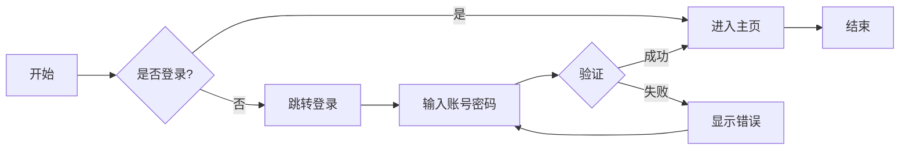
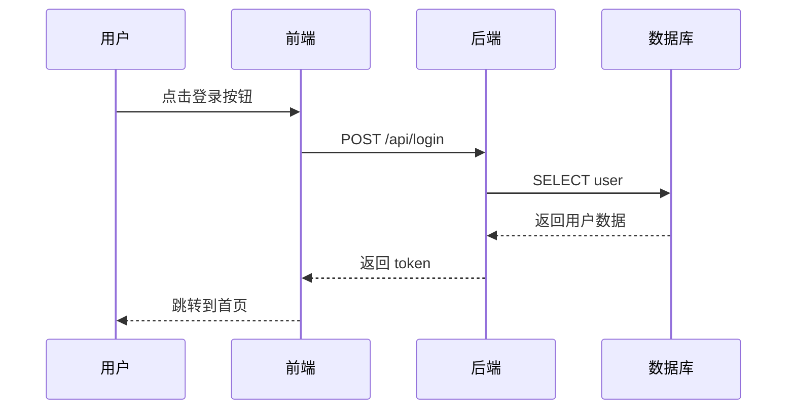
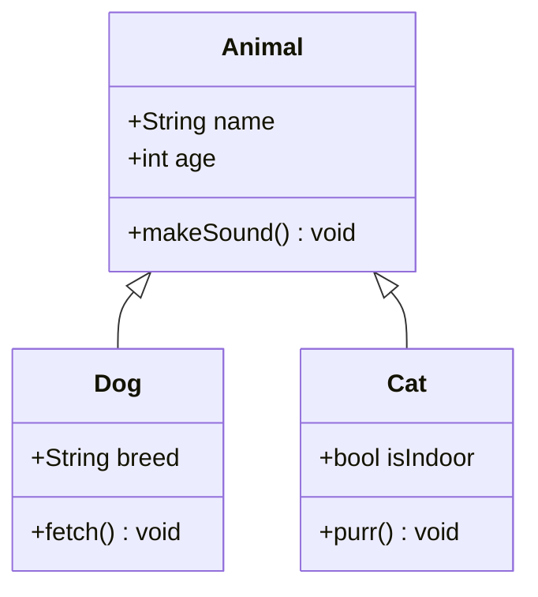
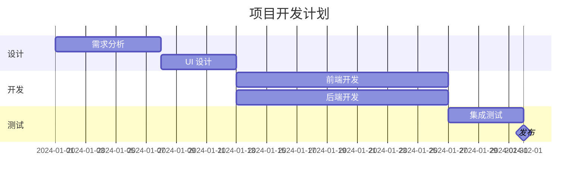
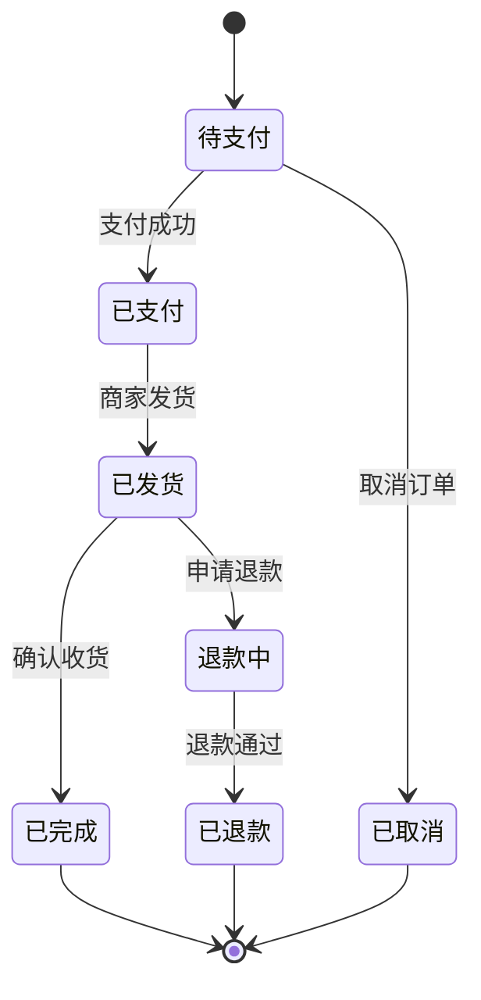
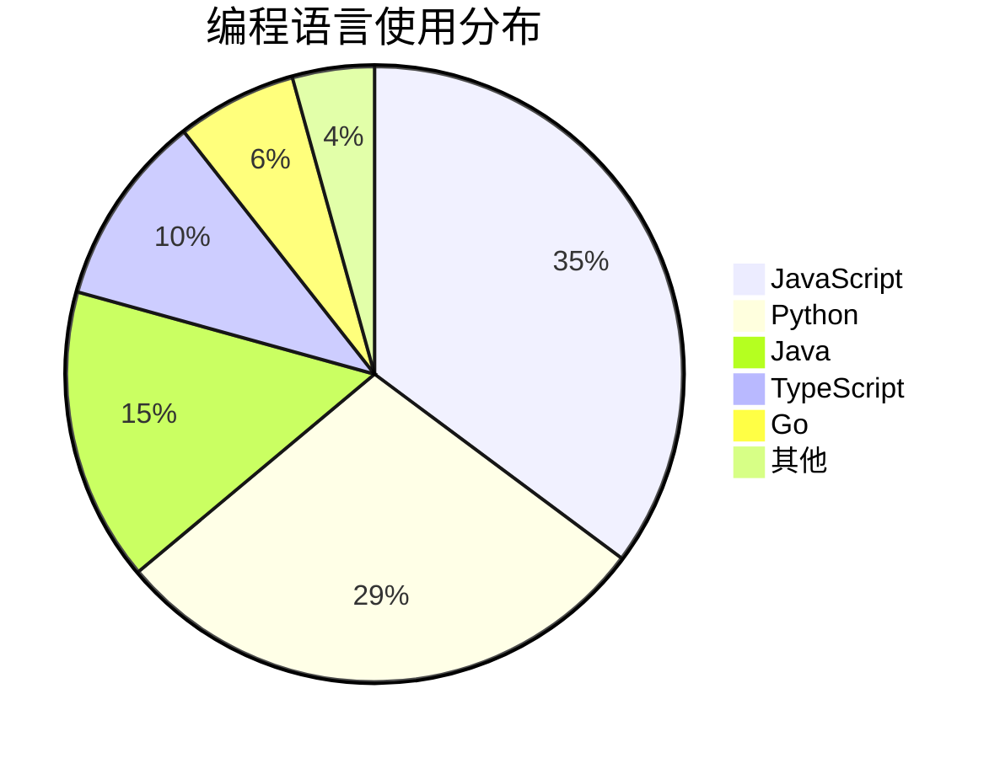

<a id="top"></a>
# Markdown 编辑器能力测试

> 一份全面的 Markdown 语法测试文档，覆盖常见与边缘用例。
> 如果你的编辑器能完美渲染此文档，说明它很强大。

---

## 目录

- [1. 标题层级](#h)
- [2. 文本样式](#text)
- [3. 链接](#link)
- [4. 图片](#img)
- [5. 代码](#code)
- [6. 表格](#table)
- [7. 列表](#list)
- [8. 任务列表](#task)
- [9. 引用](#quote)
- [10. 分割线](#hr)
- [11. 脚注](#fn)
- [12. HTML 标签](#html)
- [13. 转义与特殊字符](#escape)
- [14. Emoji](#emoji)
- [15. 数学公式](#math)
- [16. Mermaid 图表](#mermaid)
- [17. 定义列表](#dl)
- [18. 缩进与空白](#space)
- [19. 自动链接与邮箱](#auto)
- [20. 参考式链接](#ref)
- [21. 内嵌 HTML 表格](#html-table)

---

<a id="h"></a>
## 1. 标题层级

# H1 - 一级标题
## H2 - 二级标题
### H3 - 三级标题
#### H4 - 四级标题
##### H5 - 五级标题
###### H6 - 六级标题

####### 7 个 `#` 不会变成标题（非标准语法）

交替标题写法（Setext-style，仅 H1/H2）：

H1 交替写法
============

H2 交替写法
------------

[↑ 回到目录](#top)

---

<a id="text"></a>
## 2. 文本样式

| 样式 | 语法 | 渲染效果 |
|------|------|----------|
| 粗体 | `**text**` | **这是粗体** |
| 斜体 | `*text*` | *这是斜体* |
| 粗斜体 | `***text***` | ***这是粗斜体*** |
| 删除线 | `~~text~~` | ~~这是删除线~~ |
| 行内代码 | `` `code` `` | `const x = 1;` |
| 下划线 | `<u>text</u>` | <u>这是下划线</u> |
| 高亮 | `==text==` | ==这是高亮== |
| 上标 | `X^2^` | X^2^ |
| 下标 | `H~2~O` | H~2~O |
| 键盘 | `<kbd>Ctrl</kbd>` | <kbd>Ctrl</kbd> + <kbd>C</kbd> |
| 小字 | `<small>text</small>` | <small>这行字比较小</small> |

**行内代码中的反引号处理：** `` 使用 ` `` ` 包裹 `` ` `` ``

**嵌套样式：** ***粗斜体中的 `代码`*** 和 ~~***粗斜删除线***~~

**非标准高亮**（取决于编辑器）：==高亮文字==

[↑ 回到目录](#top)

---

<a id="link"></a>
## 3. 链接

### 3.1 基本链接

- [外部链接（https）](https://www.example.com)
- [外部链接（http）](http://www.example.com)
- [带标题的链接](https://www.example.com "鼠标悬停时显示的标题")
- [相对路径链接](./markdown-toc-demo.md)
- [锚点链接 - 跳转到目录](#top)
- <https://www.example.com> （自动链接）
- [链接中含有空格](<https://www.example.com/path with spaces>)

### 3.2 链接中包含特殊字符

- [链接中有 (括号)](<https://en.wikipedia.org/wiki/Markdown_(language)>)
- [URL 中有查询参数](https://www.google.com/search?q=markdown&lang=zh)

### 3.3 链接内的样式

- **[粗体链接](https://www.example.com)**
- *[斜体链接](https://www.example.com)*
- [`代码链接`](https://www.example.com)

### 3.4 没有链接的尖括号

- 邮件：<user@example.com>
- URL：<https://www.example.com>
- 非链接：<这不是链接>

[↑ 回到目录](#top)

---

<a id="img"></a>
## 4. 图片

### 4.1 基本图片


### 4.2 带标题的图片


### 4.3 图片作为链接

[](https://www.example.com)

### 4.4 带 alt 文本的图片（加载失败时显示）


### 4.5 调整图片大小（HTML）


### 4.6 带对齐的图片（HTML）

<div align="center">
  
</div>

[↑ 回到目录](#top)

---

<a id="code"></a>
## 5. 代码

### 5.1 缩进代码块（4 空格）

    这是用 4 个空格缩进的代码块
    第二行
        第三行缩进

### 5.2 围栏代码块（各种语言）

**JavaScript：**

```javascript
// 箭头函数、解构、模板字符串
const greet = ({ name, age }) => {
    console.log(`Hello, ${name}. You are ${age} years old.`);
};
greet({ name: "World", age: 42 });
```

**Python（带类型注解）：**

```python
from typing import Optional, List

def binary_search(arr: List[int], target: int) -> Optional[int]:
    """在有序数组中二分查找目标值"""
    left, right = 0, len(arr) - 1
    while left <= right:
        mid = (left + right) // 2
        if arr[mid] == target:
            return mid
        elif arr[mid] < target:
            left = mid + 1
        else:
            right = mid - 1
    return None
```

**SQL：**

```sql
SELECT u.name, COUNT(o.id) AS order_count
FROM users u
LEFT JOIN orders o ON o.user_id = u.id
WHERE u.created_at >= '2024-01-01'
GROUP BY u.name
HAVING COUNT(o.id) > 5
ORDER BY order_count DESC
LIMIT 10;
```

**Shell：**

```bash
#!/bin/bash
# 遍历所有 .md 文件
for file in *.md; do
    echo "Processing: $file"
    wc -l "$file"
done
```

**Diff：**

```diff
- const oldValue = getData_legacy();
+ const newValue = getData_v2();
- return { data: oldValue };
+ return { data: newValue, cached: true };
```

**无语言标注：**

```
这是一个没有指定语言的代码块
它应该使用等宽字体显示
但不会有语法高亮
```

### 5.3 嵌套代码块

在 Markdown 中展示如何写代码块：

````markdown
```python
print("Hello, World!")
```
````

### 5.4 超长代码行

```text
这是一行非常非常非常非常非常非常非常非常非常非常非常非常非常非常非常非常非常非常非常非常非常非常非常非常非常非常非常非常非常非常非常非常非常非常非常非常非常非常非常非常非常非常非常非常非常非常非常非常非常非常非常非常非常非常非常非常长的代码行，用来测试编辑器是否支持横向滚动。
```

[↑ 回到目录](#top)

---

<a id="table"></a>
## 6. 表格

### 6.1 基本对齐

| 左对齐 | 居中对齐 | 右对齐 |
|:-------|:--------:|-------:|
| 苹果 | 红色 | 5.00 |
| 香蕉 | 黄色 | 3.50 |
| 蓝莓 | 蓝色 | 12.00 |

### 6.2 包含样式和代码的表格

| 功能 | 语法示例 | 状态 |
|------|----------|:----:|
| 粗体 | `**text**` | ✅ |
| 代码 | `` `code` `` | ✅ |
| 链接 | `[text](url)` | ✅ |
| ~~删除线~~ | `~~text~~` | ✅ |
| `行内代码` | ``` `` `` ``` | ✅ |

### 6.3 空单元格

| 名称 | 值 | 备注 |
|------|----|------|
| A | 1 | |
| B | | 有备注但无值 |
| C | 3 | 正常 |
| | | 全空行 |

### 6.4 宽表格（横向滚动测试）

| # | 列 A | 列 B | 列 C | 列 D | 列 E | 列 F | 列 G | 列 H | 列 I | 列 J |
|---|------|------|------|------|------|------|------|------|------|------|
| 1 | 数据 | 数据 | 数据 | 数据 | 数据 | 数据 | 数据 | 数据 | 数据 | 数据 |
| 2 | 很长很长很长很长很长的表头 | 数据 | 数据 | 数据 | 数据 | 数据 | 数据 | 数据 | 数据 | 数据 |

### 6.5 表格中使用管道符

| 表达式 | 结果 |
|--------|------|
| `\|x\|` | \|x\| |
| `a \| b` | a \| b |

[↑ 回到目录](#top)

---

<a id="list"></a>
## 7. 列表

### 7.1 无序列表

- 第一层
- 第一层第二项
  - 第二层
  - 第二层第二项
    - 第三层
      - 第四层
- 回到第一层

### 7.2 有序列表

1. 第一项
2. 第二项
   1. 嵌套 2.1
   2. 嵌套 2.2
      1. 嵌套 2.2.1
3. 第三项

### 7.3 混合嵌套

1. 有序第一项
   - 无序嵌套
     - 再嵌套
   - 同层第二项
2. 有序第二项
   - 又一个无序

### 7.4 列表中的多段文字

1. 第一段。

   第一段的延续段落（缩进对齐）。

2. 第二段。

   > 列表中嵌套引用

   ```python
   # 列表中嵌套代码块
   print("hello")
   ```

3. 第三段。

### 7.5 列表中的其他元素

- 包含**粗体**和*斜体*
- 包含 `代码`
- 包含 [链接](https://www.example.com)
- 包含图片：
  

### 7.6 编号不连续（编辑器应自动修正）

1. 第一项
1. 第二项（写了 1 但应显示 2）
1. 第三项

### 7.7 起始编号不为 1

3. 从 3 开始
4. 第四项
5. 第五项

[↑ 回到目录](#top)

---

<a id="task"></a>
## 8. 任务列表

- [x] 已完成的任务
- [x] 也已完成
- [ ] 待完成的任务
- [ ] ~~被取消的任务~~
- [ ] 包含 **粗体** 和 `代码` 的待办
- [ ] 包含链接 [example](https://www.example.com)
  - [x] 嵌套已完成
  - [ ] 嵌套待完成
    - [ ] 第三层嵌套

[↑ 回到目录](#top)

---

<a id="quote"></a>
## 9. 引用

### 9.1 基本引用

> 这是一段引用文字。

### 9.2 多行引用

> 这是多行引用的第一行。
> 这是多行引用的第二行。
> 所有行都属于同一个引用块。

### 9.3 嵌套引用

> 第一层引用
>> 第二层引用
>>> 第三层引用
>>>> 第四层引用

### 9.4 引用中包含其他元素

> ### 引用中的标题
>
> - 引用中的列表项 1
> - 引用中的列表项 2
>
> ```python
> # 引用中的代码块
> def foo():
>     return "bar"
> ```
>
> | 引用中 | 的表格 |
> |--------|:------:|
> | 1 | 2 |
>
> > 引用中的嵌套引用
>
> ---
>
> 分割线后面的文字。

### 9.5 引用中的任务列表

> - [x] 设计
> - [ ] 开发
> - [ ] 测试

[↑ 回到目录](#top)

---

<a id="hr"></a>
## 10. 分割线

标准分割线：

---

三个星号：

***

三个下划线：

___

带空格的分割线：

- - - -

* * *

[↑ 回到目录](#top)

---

<a id="fn"></a>
## 11. 脚注

这是第一段文字，包含一个脚注引用[^1]。

这是第二段文字，包含另一个脚注引用[^longnote]。

这是第三段，行内脚注^[这是一个行内脚注，不需要单独的参考文献]。

[^1]: 这是第一个脚注的内容，可以包含**样式**和`代码`。

[^longnote]: 这是第二个脚注的内容，可以多行。

    缩进四个空格来保持脚注内容的段落格式。

    这是脚注的第二段。

[↑ 回到目录](#top)

---

<a id="html"></a>
## 12. HTML 标签

### 12.1 折叠面板

<details>
<summary>点击展开更多内容</summary>

这里是被隐藏的内容。

可以包含 **Markdown 语法**。

- 列表项 1
- 列表项 2

```python
print("Hello from inside details!")
```

</details>

<details open>
<summary>默认展开的面板</summary>

这个面板默认是展开的。

</details>

### 12.2 缩写

<abbr title="HyperText Markup Language">HTML</abbr> 和 <abbr title="Cascading Style Sheets">CSS</abbr>

### 12.3 插入与删除

- <ins>这是插入的文字</ins>
- <del>这是删除的文字</del>

### 12.4 描述列表（纯 HTML）

<dl>
  <dt>Markdown</dt>
  <dd>一种轻量级标记语言，由 John Gruber 创建。</dd>
  <dt>HTML</dt>
  <dd>超文本标记语言，用于创建网页的标准语言。</dd>
</dl>

### 12.5 其他语义标签

- 键盘快捷键：<kbd>Ctrl</kbd> + <kbd>Shift</kbd> + <kbd>Esc</kbd>
- 变量：<var>x</var> = <var>y</var> + 2
- 上标：E = mc<sup>2</sup>
- 下标：H<sub>2</sub>O
- 标记高亮：<mark>这段文字被高亮</mark>

### 12.6 注释

<!-- 这是 HTML 注释，渲染时不会显示 -->

以下是不会被渲染的内容：
<!-- TODO: 这段注释用户看不到 -->

[↑ 回到目录](#top)

---

<a id="escape"></a>
## 13. 转义与特殊字符

### 13.1 反斜杠转义

| 字符 | 转义写法 | 渲染 |
|------|----------|------|
| 星号 | `\*` | \*不是斜体\* |
| 下划线 | `\_` | \_不是斜体\_ |
| 井号 | `\#` | \# 不是标题 |
| 反引号 | `` \` `` | \`不是代码\` |
| 波浪号 | `\~` | \~不是删除线\~ |
| 管道符 | `\|` | \| 不是表格分隔符 |
| 尖括号 | `\<` | \<不是标签\> |

### 13.2 HTML 实体

- 版权符号：&copy; = `&copy;`
- 注册商标：&reg; = `&reg;`
- 商标：&trade; = `&trade;`
- 小于号：&lt; = `&lt;`
- 大于号：&gt; = `&gt;`
- & 符号：&amp; = `&amp;`
- 空格：&nbsp;&nbsp;&nbsp;这里有三个不换行空格
- em-dash：&mdash; = `&mdash;`
- en-dash：&ndash; = `&ndash;`
- 省略号：&hellip; = `&hellip;`

### 13.3 反斜杠本身

两个反斜杠：\\\\

[↑ 回到目录](#top)

---

<a id="emoji"></a>
## 14. Emoji

### 14.1 Emoji 短代码（取决于编辑器）

:smile: :heart: :rocket: :warning: :bulb: :memo: :bug: :white_check_mark: :x:

### 14.2 Unicode Emoji

😀 😂 🔥 🚀 ⭐ ✅ ❌ 💡 📝 🐛 🎉 🎨

### 14.3 复杂 Emoji

👨‍💻 👩‍🔬 🧑‍🤝‍🧑 👨‍👩‍👧‍👦 🏳️‍🌈

### 14.4 带肤色的 Emoji

👍🏻 👍🏼 👍🏽 👍🏾 👍🏿

[↑ 回到目录](#top)

---

<a id="math"></a>
## 15. 数学公式

### 15.1 行内公式

勾股定理：$a^2 + b^2 = c^2$

二次公式：$x = \frac{-b \pm \sqrt{b^2 - 4ac}}{2a}$

欧拉公式：$e^{i\pi} + 1 = 0$

### 15.2 块级公式

$$
\begin{aligned}
\nabla \times \vec{\mathbf{E}} &= -\frac{\partial \vec{\mathbf{B}}}{\partial t} \\
\nabla \times \vec{\mathbf{B}} &= \mu_0 \vec{\mathbf{J}} + \mu_0 \epsilon_0 \frac{\partial \vec{\mathbf{E}}}{\partial t}
\end{aligned}
$$

### 15.3 矩阵

$$
\begin{pmatrix}
a & b \\
c & d
\end{pmatrix}
\begin{bmatrix}
1 & 2 \\
3 & 4
\end{bmatrix}
\begin{vmatrix}
x & y \\
z & w
\end{vmatrix}
$$

### 15.4 分段函数

$$
f(x) =
\begin{cases}
x^2 & \text{if } x \geq 0 \\
-x^2 & \text{if } x < 0
\end{cases}
$$

### 15.5 大型运算符

$$
\sum_{n=1}^{\infty} \frac{1}{n^2} = \frac{\pi^2}{6}
$$

$$
\lim_{x \to 0} \frac{\sin x}{x} = 1
$$

$$
\int_{-\infty}^{\infty} e^{-x^2} \, dx = \sqrt{\pi}
$$

### 15.6 希腊字母

$\alpha \beta \gamma \delta \epsilon \zeta \eta \theta \iota \kappa \lambda \mu \nu \xi \omicron \pi \rho \sigma \tau \upsilon \phi \chi \psi \omega$

大写：$\Gamma \Delta \Theta \Lambda \Xi \Pi \Sigma \Upsilon \Phi \Psi \Omega$

### 15.7 化学方程式

$$
\ce{2H2 + O2 ->[\Delta] 2H2O}
$$

[↑ 回到目录](#top)

---

<a id="mermaid"></a>
## 16. Mermaid 图表

### 16.1 流程图



### 16.2 时序图



### 16.3 类图



### 16.4 甘特图



### 16.5 状态图



### 16.6 饼图



[↑ 回到目录](#top)

---

<a id="dl"></a>
## 17. 定义列表

一些 Markdown 扩展支持定义列表：

Apple
: 一种水果，通常为红色或绿色，富含维生素 C。

Orange
: 一种柑橘类水果，橙色外皮，多汁。

   定义中可以包含多个段落。

Banana
: 一种长条形黄色水果，富含钾。
: 也可以有多个定义。

[↑ 回到目录](#top)

---

<a id="space"></a>
## 18. 缩进与空白

### 18.1 行尾两个空格（强制换行）  
这是第一行（行尾有两个空格）  
这是第二行（不会成为新段落）

### 18.2 空行分隔段落

这里是一段。

这里是另一段（中间有空行）。

### 18.3 混合空格和 Tab

		这是用 Tab 缩进的代码（如果未渲染为代码块，说明 Tab 支持不完善）

    这是用 4 空格缩进的代码

### 18.4 行内多余空格

这里有    五个空格    在文字中间。

### 18.5 中英文混排

This is English mixed with 中文 content in the same paragraph. 看看中英文之间的间距是否合理。
Another English sentence followed by 另一段中文。And then English again.

[↑ 回到目录](#top)

---

<a id="auto"></a>
## 19. 自动链接与邮箱

### 19.1 自动链接

https://www.example.com

http://www.example.com

ftp://ftp.example.com

### 19.2 邮箱

<user@example.com>

<name+tag@example.com>

### 19.3 非标准协议

tel:+86-138-0000-0000

[↑ 回到目录](#top)

---

<a id="ref"></a>
## 20. 参考式链接与图片

### 20.1 参考式链接

这是一个[参考式链接][ref1]。

这是另一个[使用了不同引用文字的链接][google]。

也可以直接使用和文字相同的引用名，如 [GitHub][].

### 20.2 参考式图片

![参考式图片][placeholder]

### 20.3 隐式引用名

隐式引用的链接文字和引用名相同，写一次即可，如 [Baidu][].

[ref1]: https://www.example.com
[google]: https://www.google.com "Google 搜索引擎"
[GitHub]: https://github.com
[placeholder]: https://via.placeholder.com/150x50/0d6efd/fff?text=Reference+Style
[Baidu]: https://www.baidu.com

[↑ 回到目录](#top)

---

<a id="html-table"></a>
## 21. 内嵌 HTML 表格

<table>
  <thead>
    <tr>
      <th colspan="2" style="text-align:center">合并两列的表头</th>
      <th rowspan="2">合并行</th>
    </tr>
    <tr>
      <th>子列 A</th>
      <th>子列 B</th>
    </tr>
  </thead>
  <tbody>
    <tr>
      <td>
        <ul>
          <li>单元格内嵌列表</li>
          <li>第二项</li>
        </ul>
      </td>
      <td>
        
      </td>
      <td rowspan="2" style="vertical-align:middle;text-align:center">
        <b>合并的<br/>单元格</b>
      </td>
    </tr>
    <tr>
      <td><code>code in td</code></td>
      <td><a href="https://www.example.com">链接在 td 中</a></td>
    </tr>
    <tr>
      <td colspan="3" style="text-align:center">
        <details>
          <summary>单元格中的折叠面板</summary>
          <p>这是折叠内容</p>
        </details>
      </td>
    </tr>
  </tbody>
</table>

[↑ 回到目录](#top)

---

## 最后

<a id="end"></a>

> **测试完成！** 如果你能看到这里，并且以上所有元素都正确渲染 —
> 那么你的 Markdown 编辑器表现非常出色。

**不支持的常见功能清单（供对照）：**

- [ ] 脚注（Footnote）
- [ ] 高亮标记（`==text==`）
- [ ] 上标/下标（`X^2^` / `H~2~O`）
- [ ] 定义列表
- [ ] Mermaid 图表
- [ ] 数学公式（LaTeX）
- [ ] Emoji 短代码（`:smile:`）
- [ ] 任务列表嵌套
- [ ] 表格中的复杂内容
- [ ] 自动链接（裸 URL）
- [ ] 化学方程式

- - -

*此文档用于测试 Markdown 编辑器的渲染能力，最后更新于 2026-05-24。*

[回到顶部 ↑](#top)
