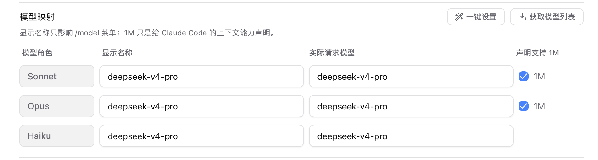
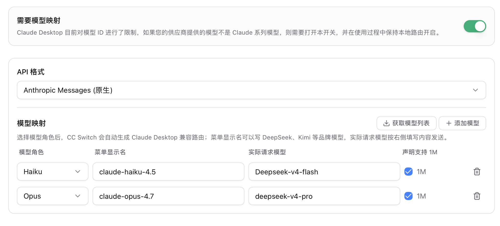
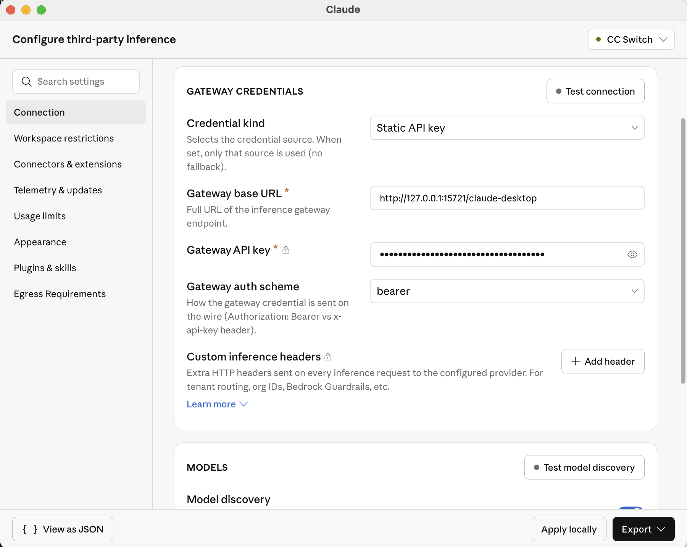
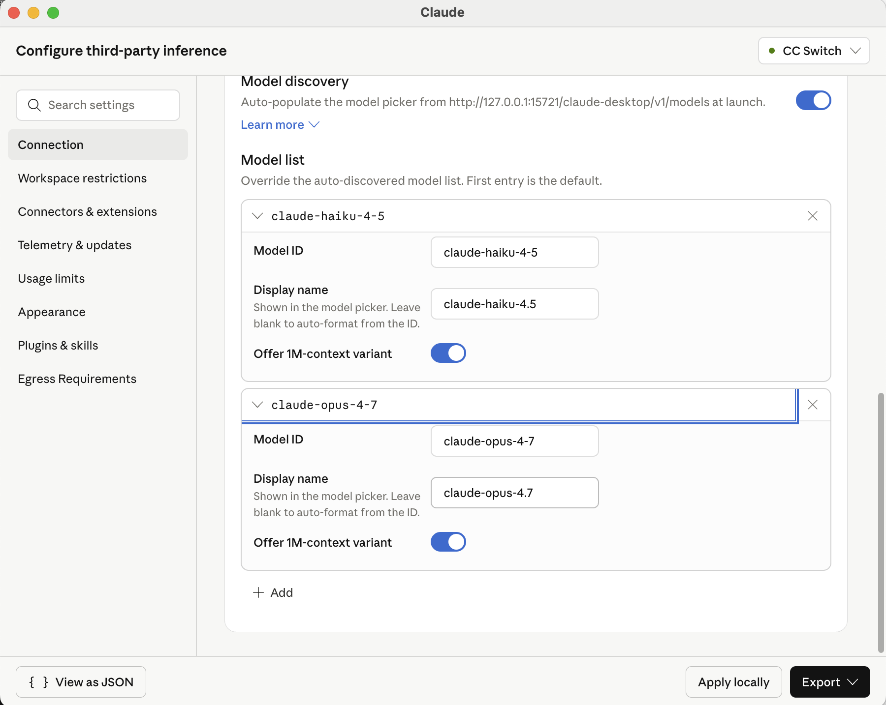

# 配置 Claude 使其支持第三方模型

> 使用 CC Switch 让 Claude Code 和 Claude Desktop 使用第三方模型（如 DeepSeek 等）。

---

## 目录

- [1. 背景说明](#toc-background)
- [2. 配置 Claude Code](#toc-claude-code)
- [3. 配置 Claude Desktop](#toc-claude-desktop)
  - [3.1 配置 CC Switch](#toc-cc-switch)
  - [3.2 开启本地路由](#toc-local-route)
  - [3.3 填写 Gateway 配置](#toc-gateway)
  - [3.4 配置 Model List](#toc-model-list)
  - [3.5 应用并重启](#toc-restart)

---

## 1. 背景说明

**Claude Code** 和 **Claude Desktop** 是两个不同的产品：

| 产品 | 形态 | 说明 |
|------|------|------|
| **Claude Code** | 终端 CLI | 在终端中使用的命令行工具 |
| **Claude Desktop** | 桌面应用 | 包含 Cowork 模式和 Code 模式，其中 Code 模式功能与 Claude Code 几乎一致 |

两者都可以通过 **CC Switch** 切换到第三方模型。

[↑ 回到目录](#toc-top)

---

## 2. 配置 Claude Code

在 CC Switch 中按如下方式填写：

> 如果还未完成初次安装配置，可以在 CC Switch 的 **设置 → 通用 → 跳过 Claude Code 初次安装确认** 中勾选该选项。

配置完成后，Claude Code 即可使用第三方模型。

[↑ 回到目录](#toc-top)

---

## 3. 配置 Claude Desktop

Claude Desktop 的配置比 Claude Code 多几个步骤，需要依次完成以下操作。

### 3.1 配置 CC Switch

在 CC Switch 中按如下方式填写：

### 3.2 开启本地路由

在 CC Switch 中开启**本地路由**功能，并记录下路由中的**地址和端口**，后续步骤会用到。

### 3.3 填写 Gateway 配置

在 Claude Desktop 中，选择 **Developer → Configure Third-Party Inference**，填写以下两项：

- **Gateway base URL** — 填入步骤 3.2 中记录的地址和端口
- **Gateway API key** — 填入你的 API Key

### 3.4 配置 Model List

在同一个配置页面中，设置模型列表：

### 3.5 应用并重启

配置完成后，点击 **Apply Locally** 并重启 Claude Desktop 即可生效。

[↑ 回到目录](#toc-top)

---

*此文档最后更新于 2026-05-24。*

[回到顶部 ↑](#toc-top)
